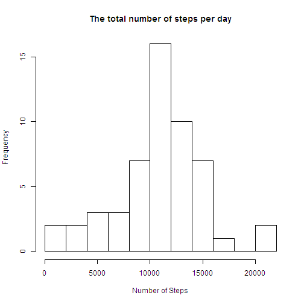
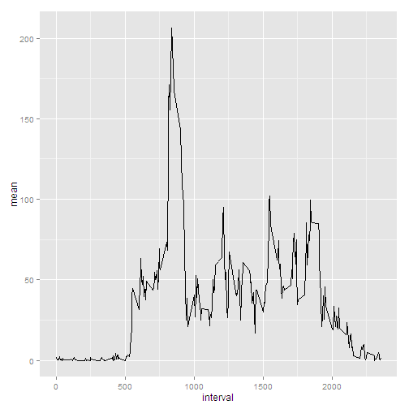
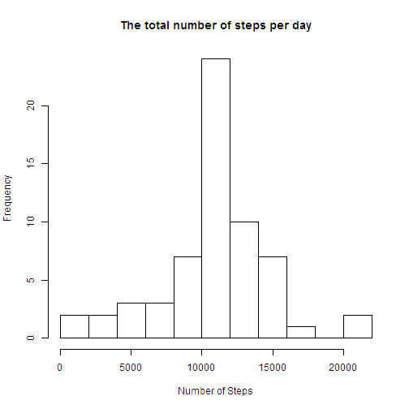
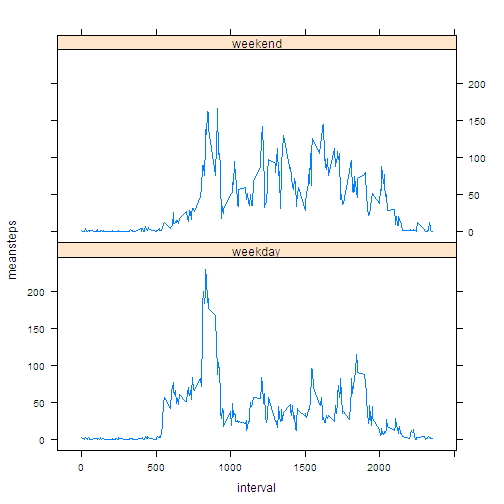

---
#RR

##Assignment 1
####Landry FABO

###Loading and preprocessing the data
A- Load Data

```r
Sys.setlocale("LC_TIME","C")
```

```
## [1] "C"
```

```r
setwd("C:/Users/IGT/Documents/Landry Stuff/repdata_data_activity")
data <- read.csv("activity.csv")
```
B-Process/transform the data 

```r
data$date <- as.Date(data$date)
comdata <- data[complete.cases(data$steps),]
```
###Mean total number of steps taken per day
A-Histogram

```r
vsteps<- tapply(comdata$steps,comdata$date,sum)
hist(vsteps, breaks=10, main="The total number of steps per day", xlab="Number of Steps")
```

 


B-Mean and median of total number of steps taken per day

```r
mean(vsteps)
```

```
## [1] 10766.19
```

```r
median(vsteps)
```

```
## [1] 10765
```

###Average daily activity pattern
A-Plot

```r
alphamean <- tapply(comdata$steps, comdata$interval, mean)
alphaday <- data.frame(interval=names(alphamean), mean=alphamean, stringsAsFactors = FALSE)
dimnames(alphaday$mean) <- NULL
alphaday$interval <- as.numeric(alphaday$interval)
library(ggplot2)
g <- ggplot(alphaday,aes(interval,mean))
g <- g + geom_line()
g
```

 


B-Maximum number of steps

```r
maxsteps <- alphaday$interval[grepl(max(alphamean), alphaday$mean)]
maxsteps
```

```
## [1] 835
```

###Imputing missing values
A-Missing values in the dataset

```r
nrow(data[!complete.cases(data$steps),])
```

```
## [1] 2304
```
B-Filling in all of the missing values in the dataset

```r
datana <- data[is.na(data),] 
xtabs( ~ date,data=datana)
```

```
## date
## 2012-10-01 2012-10-08 2012-11-01 2012-11-04 2012-11-09 2012-11-10 
##        288        288        288        288        288        288 
## 2012-11-14 2012-11-30 
##        288        288
```
C-New Dataset

```r
newdata <- data
newdata$steps[is.na(newdata$steps)] <- round(alphamean)
```
D-Histogram

```r
vstepsday <- tapply(newdata$steps,newdata$date,sum)
hist(vstepsday, breaks=10, main="The total number of steps per day", xlab="Number of Steps")
```

 


###Differences in activity patterns between weekdays and weekends
A-New factor variable in the dataset 

```r
newdata$weekday <- weekdays(newdata$date)
newdata$week <- "weekday"
newdata$week[grepl("Sunday",newdata$weekday)] <- "weekend"
newdata$week[grepl("Saturday",newdata$weekday)] <- "weekend"
newdata$week <- as.factor(newdata$week)
```
B-Panel Plot

```r
innewmean <- tapply(newdata$steps, list(newdata$interval, newdata$week), mean)
innewmean <- data.frame(innewmean)
innewmean$interval <-as.numeric(rownames(innewmean))
library(reshape2)
innewmelt <- melt(innewmean, id.vars=c("interval"), measure.vars=c("weekday", "weekend")) 
colnames(innewmelt) <- c("interval","week", "meansteps")
library(lattice)
xyplot(meansteps ~ interval|week, data=innewmelt, type="l", layout= c(1,2))
```

 

